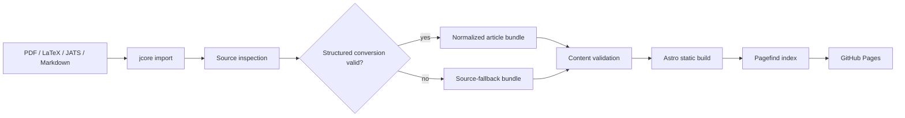

# JCORE Publication Pipeline and Rendering Design

**Date:** 2026-08-24
**Status:** Approved for implementation

## 1. Summary

JCORE will be repaired as a durable, Git-driven scholarly publishing system with
two connected workstreams:

1. A deterministic article normalization and rendering pipeline that produces
   readable, link-safe HTML from the existing eight-article corpus.
2. A unified editorial CLI that accepts PDF, LaTeX, JATS XML, Markdown, and
   recorded DOI resolutions, emits reviewable article bundles, and falls back to
   the original source when structured conversion is unavailable or unsafe.

The public site remains a bilingual Astro static site deployed to GitHub Pages.
No database, login system, online submission workflow, or review backend is added
in this phase.

## 2. Goals

- Render all existing JCORE and external articles without Pandoc syntax,
  broken internal anchors, or visible KaTeX parse errors.
- Preserve headings, explicit labels, figures, tables, equations, footnotes,
  code blocks, citations, and source links whenever the source contains them.
- Ensure every generated internal link points to an element that exists.
- Make the article renderer resilient to partial source quality. A single
  unsupported equation or missing optional label must produce a diagnostic and a
  readable fallback, not a blank article.
- Give operators one documented CLI for inspection, conversion, validation,
  staging, and promotion.
- Preserve the original PDF or source package for every imported record when
  redistribution rights allow it.
- Make conversion results deterministic and reviewable in Git.
- Fix desktop, tablet, and 390px mobile interaction failures without changing
  the approved editorial visual direction.

## 3. Non-Goals

- Online manuscript submission or peer-review workflows.
- User authentication, editor accounts, or a database-backed CMS.
- Automatic DOI registration.
- Network access during normal validation, static builds, or CI.
- Reproducing the original publisher's visual design.
- Silently inferring copyright permission from a public URL.

## 4. Current Findings

The current site already has useful boundaries:

- Content contracts and relationship validation in `src/lib/content` and
  `scripts/validate`.
- LaTeX, JATS, and recorded DOI adapters in `scripts/import`.
- Static Astro routes for bilingual discovery, article reading, search, and
  citation downloads.
- Pagefind indexing and GitHub Pages deployment.

The main failures are at the boundary between imported source and public HTML:

- Pandoc div fences, attributes, citation markers, and simple tables are not
  normalized consistently.
- Display math environments can reach the inline math parser, creating KaTeX
  errors.
- Explicit source labels such as `sec:*`, `fig:*`, and `table:*` are not
  consistently assigned to output elements.
- References can point to missing targets or duplicate IDs.
- Table and figure media can use source dimensions that overflow the article
  column.
- The mobile header still renders the desktop station bar and its navigation
  drawer lacks complete disclosure, focus, escape, and outside-click behavior.
- Existing tests cover build validity but not rendered-content quality or the
  complete interaction state model.

## 5. Approved Architecture

### 5.1 Canonical Article Bundle

Every imported or manually authored article is represented by a bundle:

```text
<record-root>/
  index.md              # validated publication metadata
  body.md               # normalized Markdown when available
  import-report.json    # source, converter, checksums, diagnostics
  source/               # original source files when redistribution is allowed
  assets/               # normalized figures and supplementary assets
```

The metadata contract gains explicit representation state:

- `renderMode: structured | source-fallback`
- `sourceFormat: pdf | latex | jats | markdown | doi`
- `sourceFiles`: relative paths and display labels for original files
- `conversion`: importer version, status, output checksum, and report path
- `pdf`: a stable public path when a PDF is available

`source-fallback` records remain valid public records. They render the article
metadata and abstract, show the conversion diagnostic, expose the original
source viewer/download, and never pretend that a missing structured body is a
fully rendered article.

Rights validation applies to both normalized full text and vendored fallback
files. If a source cannot legally be redistributed, the record may link to its
official URL but must not copy the source into `public/` or the article bundle.

### 5.2 Import Lifecycle

```text
input
  -> identify source type
  -> load and checksum source
  -> inspect security, rights, roots, assets, and references
  -> parse source
  -> normalize to canonical Markdown and assets
  -> render preflight and link/asset checks
  -> emit staging bundle
  -> operator review
  -> promote into published content
  -> validate, build, index, deploy
```

The CLI does not overwrite an existing record by default. Staging writes are
atomic and use a temporary directory. Promotion requires a successful
validation result or an explicitly acknowledged source fallback.

### 5.3 Supported CLI Commands

The package exposes the command through `npm run jcore -- ...`:

```text
jcore inspect <input> [options]
jcore import <input> --manifest <file> [options]
jcore validate <path>
jcore promote <staged-record>
jcore report <record>
```

Input detection supports:

- `.pdf` files as source-fallback records unless an optional text converter
  produces a validated structured result.
- LaTeX directories and archives with a declared or uniquely detected root.
- JATS XML files and packages with a declared root when necessary.
- Markdown files or article directories.
- DOI imports only through a recorded, checksum-verified resolution; discovery
  remains an explicit network operation outside `validate` and `build`.

Manifests are mandatory for promotion. They provide the stable identity,
article kind, publication metadata, official URL, rights evidence, and source
provenance. Source-derived metadata may prefill a manifest, but the importer
must not silently invent rights, authorship, or publication ownership.

### 5.4 Normalization and Rendering

The article pipeline is split into explicit stages:

1. **Source normalization:** convert Pandoc/LaTeX/JATS artifacts into a
   canonical Markdown-plus-raw-HTML representation while emitting diagnostics.
2. **Structural indexing:** collect headings, explicit labels, figures, tables,
   footnotes, and reference targets from the canonical representation.
3. **Markdown rendering:** parse GFM and math, then render through rehype.
4. **Article post-processing:** assign stable IDs, rewrite valid internal
   references, remove or de-link unresolved references, and attach media
   metadata.
5. **Safety and quality checks:** sanitize raw HTML, detect KaTeX errors,
   detect remaining source artifacts, verify asset paths, and return a structured
   render report.

Rules:

- Explicit source IDs are preserved when valid; duplicate IDs receive
  deterministic suffixes and all known references are rewritten.
- Generated heading IDs and the table of contents use the same indexed ID map.
- Unresolved references remain readable text without a broken `href`, and are
  recorded as warnings.
- Pandoc div fences preserve their inner content. Known blocks such as
  algorithmic and tabular content receive stable classes; unknown blocks are
  retained as neutral content instead of being silently deleted.
- Display environments such as `equation`, `equation*`, `align`, and `align*`
  are isolated as block math before KaTeX processing.
- Unsupported math is displayed as escaped source text with a diagnostic; the
  renderer must not ship visible KaTeX error markup.
- Simple tables are parsed using separator column positions where available,
  preserving cell spaces and alignment; pipe tables continue to use GFM.
- Raw HTML is restricted to the scientific subset needed by the corpus:
  semantic text, figures, images, embeds, tables, links, code, and footnotes.
  Scripts, event-handler attributes, unsafe URLs, and unrelated embeds are
  rejected or removed.

The renderer returns HTML plus diagnostics, indexed headings, and media
references. Build validation fails on fatal diagnostics and reports warnings
without hiding them.

### 5.5 Public Article Fallback

`ArticleLayout` renders two explicit modes:

- **Structured mode:** the current three-column scholarly reading layout with
  table of contents, prose, citations, rights, related articles, figures,
  tables, equations, and footnotes.
- **Source fallback mode:** the same metadata header and ownership/rights
  panels, followed by a clearly labeled conversion notice, PDF preview when
  available, original-file list, download links, and the import report summary.

Fallback media is constrained to the content column, has stable responsive
dimensions, and can be opened in a separate browser context. It must not create
horizontal page overflow.

### 5.6 UI Interaction Model

The existing editorial visual system remains in place. Interaction fixes include:

- Mobile header hides the desktop station bar and exposes one navigation drawer.
- Drawer button exposes `aria-expanded` and `aria-controls`, toggles a stable
  panel, closes on Escape, closes after navigation, and restores focus.
- Drawer interaction is available without JavaScript through a visible
  navigation fallback where practical.
- Theme initialization runs before paint, follows system preference by default,
  persists explicit light/dark choice, and exposes `aria-pressed`.
- Language links preserve the current route and remain keyboard accessible.
- Article table-of-contents links use the renderer's indexed IDs and account
  for the fixed header offset.
- Filters and search preserve URL state, reset predictably, and do not depend
  on fragile positional selectors.
- Citation and source links expose stable labels, download behavior, and
  visible failure states.
- All controls retain visible focus states and meet the existing accessibility
  test requirements.

## 6. Data Flow



## 7. Testing and Acceptance

### Renderer tests

- Unit fixtures for headings with attributes, Pandoc divs, simple tables,
  display equations, unsupported math, figures, footnotes, and references.
- One corpus contract test per existing article that asserts:
  - no visible Pandoc fences or source attributes;
  - no `.katex-error`;
  - no duplicate IDs;
  - no broken internal anchors;
  - all local media resolves;
  - expected figures, tables, and equations remain present.

### CLI tests

- Detect each supported input type.
- Produce deterministic checksums and staging output.
- Reject unsafe or rights-invalid input.
- Emit a structured record on successful conversion.
- Emit a source-fallback record on conversion failure without losing the source.
- Refuse accidental overwrite and support explicit promotion.
- Preserve diagnostics in `import-report.json`.

### Browser tests

- Desktop article reading and citation links.
- 390px header/drawer/theme behavior.
- 768px tablet layout and article media containment.
- No horizontal overflow on every article route.
- Keyboard navigation, focus visibility, and accessible names.

### Build acceptance

```text
npm run typecheck
npm run lint
npm test
npm run build:search
npm run test:e2e
```

The final build must contain valid bilingual routes, Pagefind assets, citation
endpoints, article media, and no fatal diagnostics.

## 8. Implementation Boundaries

Primary modules to change:

- `src/lib/content/contracts.ts`
- `src/lib/content/types.ts`
- `src/lib/article/`
- `src/layouts/ArticleLayout.astro`
- `src/components/site/SiteHeader.astro`
- `src/styles/global.css`
- `src/styles/typography.css`
- `scripts/import/`
- `scripts/validate/`
- `scripts/jcore.ts`
- `tests/unit/`, `tests/contract/`, and `tests/e2e/`
- `docs/importing.md` and `README.md`

The existing uncommitted changes in `src/layouts/SiteLayout.astro` and
`src/lib/article/render.ts` are retained and integrated; they are not reverted.

## 9. Operational Result

After implementation, an operator can add a paper by preparing one manifest and
running the CLI. The operator receives a deterministic report that answers:

- what source was read;
- whether rights were recorded;
- which representation was generated;
- which equations, figures, tables, and references need review;
- where the original source is stored;
- whether the record is ready for promotion.

The public site remains simple to deploy, while the repository becomes a
reviewable publication ledger rather than a collection of manually patched
pages.
